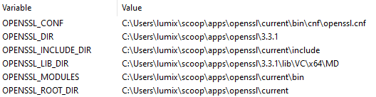

## berq, making sense of the discord api
> *pronounced birth*

written in rust using:
- `actix-web` `awc` for http and ws clients
- `tokio` `tokio-stream` for async (heartbeat interval)
- `serde` `serde-json` for parsing JSON responses

berq is *not* a library, just a small project to understand the [discord api](https://discord.com/developers/docs/intro) better, don't expect the best code

## usage
add your discord bot token as an env var  
create a file in the root project directory called `.env`
```
BOT_TOKEN=your_discord_bot_token_here
```
you also need to install openssl, on windows using
```
scoop install main/openssl
```
also make sure your windows env vars are correct (mainly `OPENSSL_DIR` and `OPENSSL_LIB_DIR`)  


